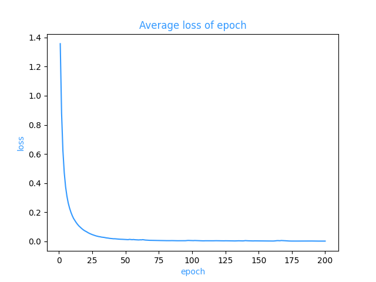

# 基于Bert的中文命名实体识别

## 数据集
实验数据来自[CLUENER2020](https://github.com/CLUEbenchmark/CLUENER2020)。这是一个中文细粒度命名实体识别数据集，是基于清华大学开源的文本分类数据集THUCNEWS，选出部分数据进行细粒度标注得到的。该数据集的训练集、验证集和测试集的大小分别为10748，1343，1345，平均句子长度37.4字，最长50字。由于测试集不直接提供，考虑到leaderboard上提交次数有限，本项目使用CLUENER2020的验证集作为模型表现评判的测试集。

CLUENER2020共有10个不同的类别，包括：组织(organization)、人名(name)、地址(address)、公司(company)、政府(government)、书籍(book)、游戏(game)、电影(movie)、职位(position)和景点(scene)。

原始数据分别位于具体模型的/data/clue/路径下，train.json和test.json文件中，文件中的每一行是一条单独的数据，一条数据包括一个原始句子以及其上的标签，具体形式如下：
```JSON
{
	"text": "浙商银行企业信贷部叶老桂博士则从另一个角度对五道门槛进行了解读。叶老桂认为，对目前国内商业银行而言，",
	"label": {
		"name": {
			"叶老桂": [
				[9, 11],
				[32, 34]
			]
		},
		"company": {
			"浙商银行": [
				[0, 3]
			]
		}
	}
}
```
## 模型

&bull; Betr-base-chinese+softmax
## 训练


## 项目结构

* ner
  * bert-base-chinese(预训练bert模型)
  * dataset(中文实体数据集)
  * model(模型)
  * weights(模型训练权重文件)
  * .gitattributes(lfs 大文件追踪目录)
  * test.py(测试代码)
  * train.py(训练代码)
## 第三方库
* pytorch
* transformers
* numpy
* tensorboard
* tqdm


